# 🛡️ Security Vulnerability Patch Tracker

**Security Vulnerability Patch Tracker (SVPT)** is a web-based cybersecurity dashboard for tracking software vulnerabilities, monitoring patch status, managing remediation workflows, and visualizing security posture.

The platform provides an interactive interface for vulnerability analysis, verification, asset exposure monitoring, security scanning, reporting, and audit tracking.

🌐 **Live Demo:** https://security-patch-tracker.onrender.com/

---

## ✨ Features

* 📊 Security operations dashboard
* 🔐 Secure access console
* 🐞 Vulnerability tracking and analysis
* 📝 Patch verification workflow
* 🛠️ Remediation orchestration
* 📋 Vulnerability findings ledger
* 📊 Security posture reporting
* 🖥️ Asset exposure monitoring
* 🌐 Network topology visualization
* 🔍 Vulnerability scanning interface
* 📜 Security audit logs

---

# 📸 Application Screenshots

> Create a folder named **`screenshot`** in your repository and upload the images using the filenames shown below.

---

## 🏠 Landing Page

The main entry point of SVPT, introducing the platform and providing access to the security dashboard.


---

## 🔐 Security Access Console

A secure access interface for entering the platform and selecting a simulation or user profile.

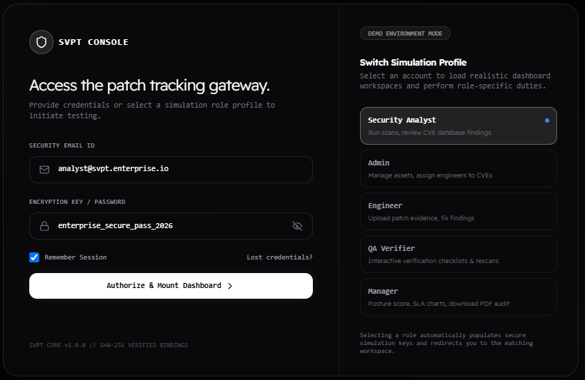

---

## 📊 Security Operations Dashboard

Provides an overview of vulnerability status, risk levels, patch compliance, severity distribution, and security activity.

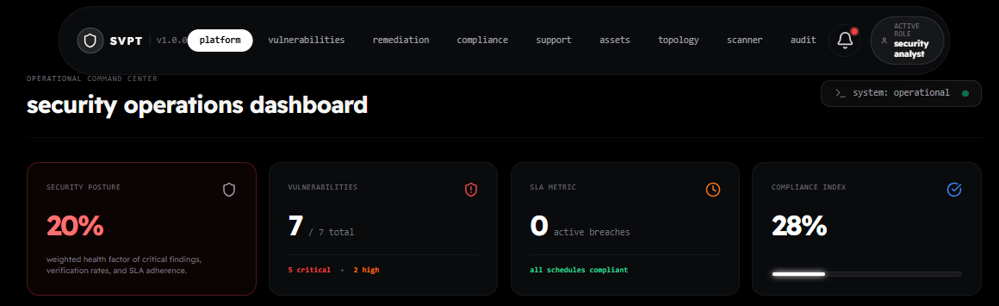

---

## ✅ Patch Verification Workflow

An interactive verification interface for reviewing vulnerability details, checking remediation steps, and approving or rejecting a patch.

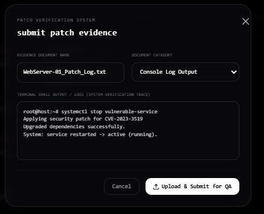

---

## 🐞 Vulnerability Details

Displays detailed information about a selected vulnerability, including risk information, affected infrastructure, remediation guidance, and activity history.

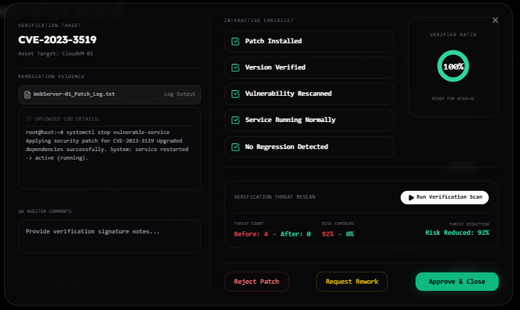

---

## 📚 CVE Education Dashboard

Provides additional information to help users understand vulnerabilities, risk, assessment, and mitigation concepts.

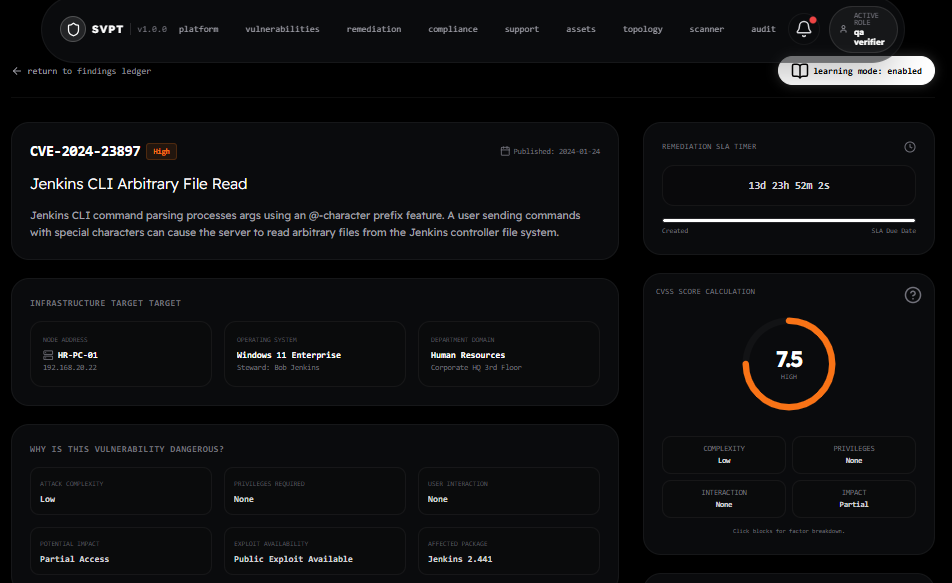
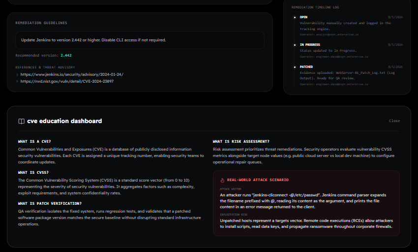

---

## 🛠️ Patch Orchestration Board

Organizes vulnerabilities according to their remediation progress and patching workflow.

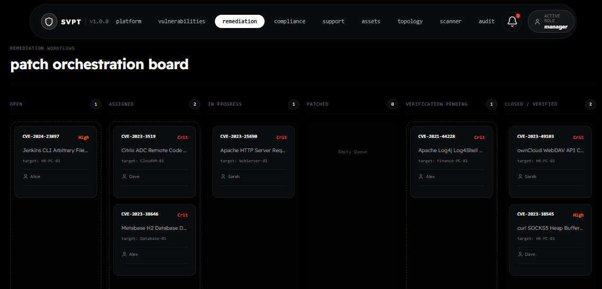

---

## 📋 Vulnerability Findings Ledger

A searchable and filterable table for viewing vulnerabilities, affected assets, severity levels, CVSS scores, and current patch status.

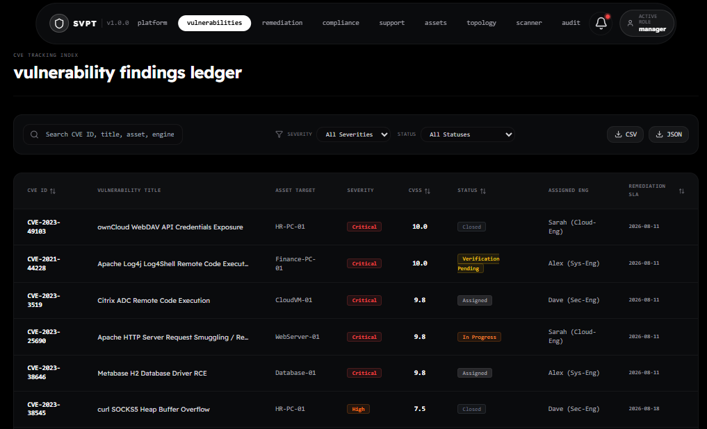

---

## 🖥️ Asset Exposure Workbench

Displays monitored infrastructure assets and their associated exposure information.

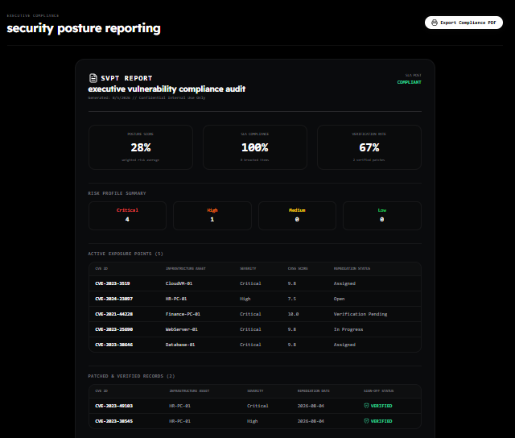

---

## 📈 Asset Exposure Matrix

Provides a structured view of assets, associated vulnerabilities, exposure levels, and overall threat status.

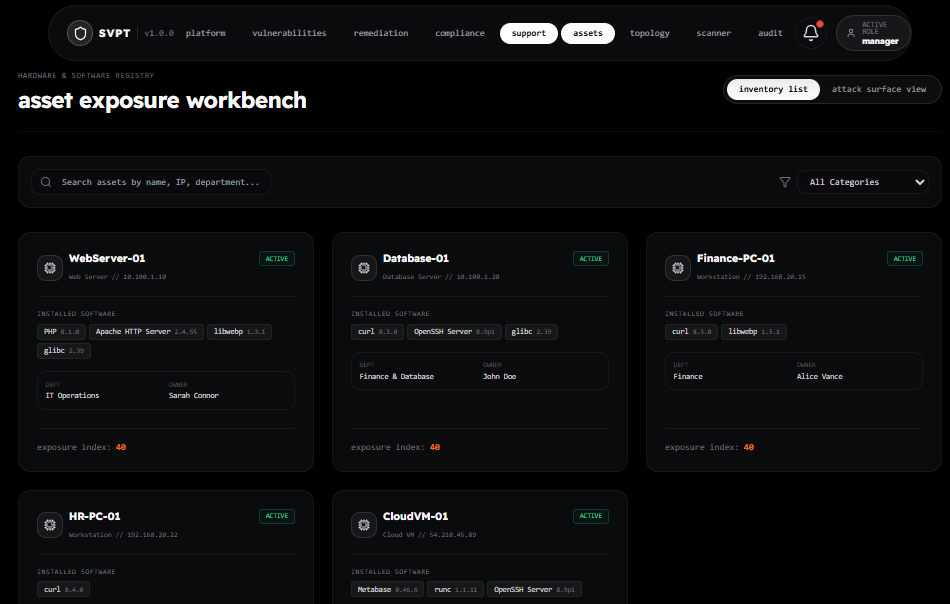

---

## 🌐 Network Topology & Routing

Visualizes the relationship between infrastructure assets and provides an interactive representation of the network environment.

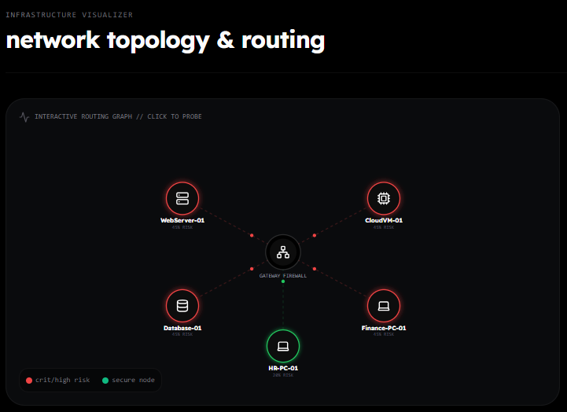

---

## 🔍 Vulnerability Scanner

Provides multiple scanning profiles and displays simulated vulnerability scanning activity and results.

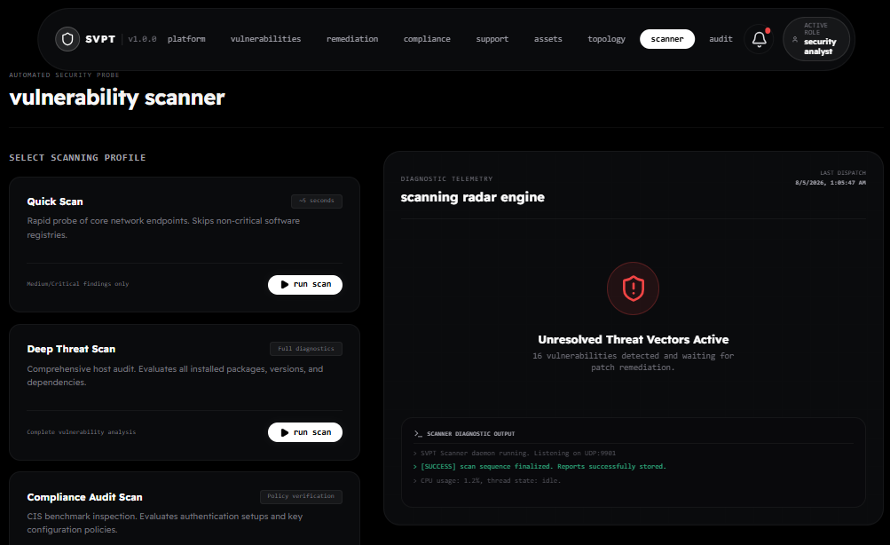

---

## 📜 Security Audit Logs

Tracks important security-related actions and system events to support monitoring and accountability.

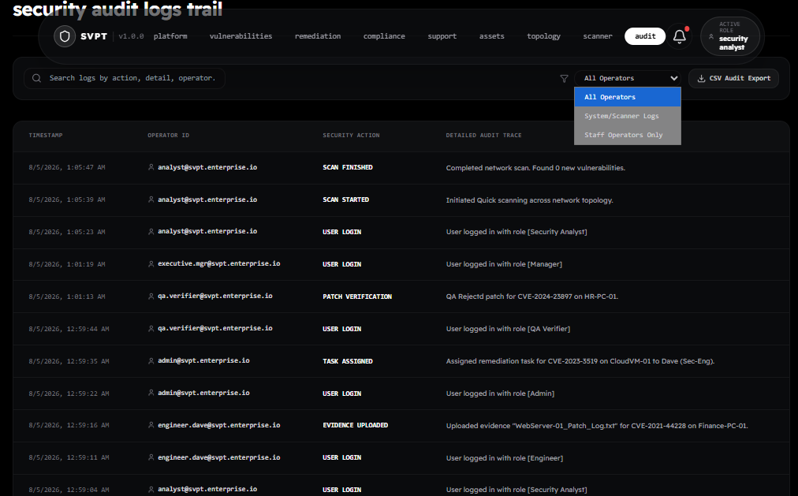

---

# 🔄 Application Workflow

```text
Identify Vulnerability
        ↓
Analyze Risk
        ↓
Assign Remediation
        ↓
Apply / Verify Patch
        ↓
Update Security Status
        ↓
Generate Reports & Audit Logs
```

---

# ⚙️ Technology Stack

| Component       | Technology   |
| --------------- | ------------ |
| Frontend        | React        |
| Language        | TypeScript   |
| Build Tool      | Vite         |
| Styling         | Tailwind CSS |
| CSS Processing  | PostCSS      |
| Browser Support | Autoprefixer |
| Version Control | Git & GitHub |
| Deployment      | Render       |

---

# 📁 Screenshot Folder Structure

Create the folder:

```text
screenshot/
```

Upload your screenshots using these exact names:

```text
screenshot/
├── 01-landing-page.png
├── 02-security-access-console.png
├── 03-security-dashboard.png
├── 04-patch-verification.png
├── 05-vulnerability-details.png
├── 06-cve-education-dashboard.png
├── 07-patch-orchestration.png
├── 08-vulnerability-findings.png
├── 09-security-posture-report.png
├── 10-asset-exposure-workbench.png
├── 11-asset-exposure-matrix.png
├── 12-network-topology.png
├── 13-vulnerability-scanner.png
└── 14-security-audit-logs.png
```

The paths in this README are already connected to these filenames. For example:

```md

```

---

# 🎯 Project Objective

SVPT was developed to provide a centralized and interactive platform for organizing vulnerability information, monitoring patch status, and improving visibility into security-related activities.

The project demonstrates the application of modern frontend development and software engineering practices to a cybersecurity-focused monitoring problem.

---

# 🚀 Project Links

**GitHub Repository:** https://github.com/aaliyahalics23021/Security-Patch-Tracker

**Live Application:** https://security-patch-tracker.onrender.com/

---

# ⚠️ Disclaimer

This project is intended for **educational and demonstration purposes**. The application uses simulated security data and workflows to demonstrate vulnerability tracking, patch management, scanning, reporting, and audit concepts.

Do not upload real credentials, API keys, internal infrastructure details, or sensitive security information to the public repository.
